<div align="center">
  
</div>

<h1 align="center">👨‍💻 Về Tôi / About Me</h1>

<p align="center">
  
</p>

```
🌟 Passionate Developer | 💡 Problem Solver | 🚀 Lifelong Learner
```

- 🔭 Tôi hiện đang học ở **Trường Đại Học Nông Lâm TP.HCM**
- 🌱 Tôi đang học **ReactJS, SpringBoot**
- 💬 Hỏi tôi về **JavaScript, Java, Web Development**
- 📫 Liên hệ: **dienmailcv@gmail.com**
- ⚡ Fun fact: **Tôi Fan A Độ MIXI**

---

<h2 align="center">🛠️ Kỹ Năng & Công Nghệ / Skills & Technologies</h2>

<p align="center">
  
  
  
  
  
  
  
  
  
</p>

---

<p align="center">

</p>


<div align="center">

</div>

<div align="center">

</div>

---

<h2 align="center">🤝 Kết Nối Với Tôi / Connect With Me</h2>

<p align="center">
  <a href="https://linkedin.com/in/YOUR_LINKEDIN" target="_blank">
    
  </a>
  <a href="https://twitter.com/YOUR_TWITTER" target="_blank">
    
  </a>
  <a href="https://facebook.com/" target="_blank">
    
  </a>
  <a href="mailto:dienmailcv@gmail.com">
    
  </a>
  <a href="https://#" target="_blank">
    
  </a>
</p>

---

<h2 align="center">🎵 Now Playing on Spotify</h2>

<div align="center">
  <a href="https://www.last.fm/user/vandienz" target="_blank">
    
  </a>
</div>

<br/>

<div align="center">
  <a href="https://open.spotify.com/user/31ufv7hzmiyi4qlyf5okdwkjdhfm" target="_blank">
    
  </a>
  <a href="https://www.last.fm/user/vandienz" target="_blank">
    
  </a>
</div>

<p align="center">
  <em>🎧 Bài hát tự động cập nhật khi tôi nghe nhạc!</em>
</p>

---

<div align="center">

</div>

<div align="center">

</div>
